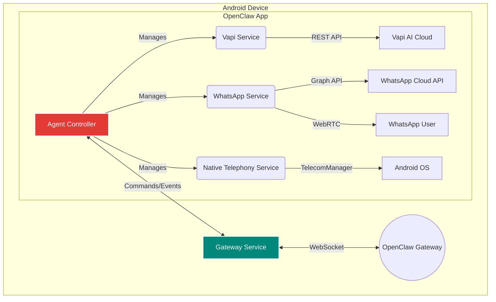

# OpenClaw Calling Node

**A custom Android OS layer for programmatic phone calling with AI agents.**

[](https://github.com/amogower/freeagent-cli/actions/workflows/android-ci.yml)
[](https://opensource.org/licenses/MIT)

This project transforms a standard Android device into a powerful **Calling Node** for the [OpenClaw](https://github.com/openclaw/openclaw) personal AI assistant framework. It provides a robust, extensible system for making and receiving programmatic phone calls and WhatsApp calls, all orchestrated by an AI agent.

 <!-- Replace with actual screenshot -->

## Core Features

- **Multi-Provider Calling**: Seamlessly switch between traditional telephony and VoIP services.
  - **Vapi AI**: Leverages Vapi's infrastructure for AI-driven voice calls over the standard phone network (PSTN).
  - **WhatsApp Business API**: Enables programmatic VoIP calls with WhatsApp users via the official Business Calling API and WebRTC.
- **Unified Agent Controller**: A central Kotlin-based controller manages all call operations, providing a single, consistent interface for the OpenClaw Gateway.
- **Gateway Integration**: Connects to the OpenClaw Gateway via a secure WebSocket, receiving commands and sending real-time call status updates.
- **Native Android Integration**: Registers as a `ConnectionService` to integrate with the native Android dialer, call logs, and Bluetooth devices.
- **Headless & UI Mode**: Can run as a background service for a fully headless "calling appliance" or with a Jetpack Compose UI for manual control and monitoring.
- **Configuration Management**: Easily configure API keys, provider preferences, and gateway settings via a user-friendly settings screen or `DataStore`.
- **CI/CD & Deployment**: Includes a full suite of build scripts, a Dockerized build environment, and a GitHub Actions workflow for automated testing and release packaging.

## Architecture Overview

The Calling Node is designed as a modular, service-oriented Android application. Each component has a distinct responsibility, ensuring a clean separation of concerns.



| Component                  | Description                                                                                             |
| -------------------------- | ------------------------------------------------------------------------------------------------------- |
| **Agent Controller**       | The core orchestrator. Receives commands from the Gateway and routes them to the appropriate service.   |
| **Gateway Service**        | Manages the WebSocket connection to the OpenClaw Gateway, handling command/response serialization.      |
| **Vapi Service**           | Integrates with the Vapi AI REST API to manage traditional PSTN calls with AI voice agents.             |
| **WhatsApp Service**       | Manages WhatsApp VoIP calls, handling Graph API signaling and WebRTC media sessions.                    |
| **Native Telephony Service** | Integrates with the Android `TelecomManager` to provide a native call experience.                     |
| **UI Layer**               | A Jetpack Compose-based UI for manual control, configuration, and monitoring.                           |

## Getting Started

### Prerequisites

- **Hardware**: An Android device (phone or tablet) running Android 10 (API 29) or higher.
- **Software**: Android Studio (latest version) or just the Android SDK command-line tools.
- **APIs**:
  - [Vapi AI Account](https://vapi.ai/)
  - [WhatsApp Business Account](https://business.facebook.com/) with a registered phone number.

### 1. Clone the Repository

```bash
gh repo clone amogower/freeagent-cli
cd freeagent-cli/openclaw-android-os
```

### 2. Configure API Keys

There are two ways to configure the application:

**A. Manual Configuration (Recommended for first-time setup)**

1. Build and install the app on your device (`./scripts/deploy.sh install-debug`).
2. Open the app and navigate to **Settings**.
3. Fill in the required API keys and IDs for the Gateway, Vapi, and WhatsApp.

**B. Using `local.properties` (For automated builds)**

Create a `local.properties` file in the project root with the following keys. This is useful for CI/CD or automated deployments.

```properties
# OpenClaw Gateway
gateway.url=ws://your-gateway-url:18789
gateway.token=your-secret-token

# Vapi AI
vapi.api.key=vapi_xxxxxxxx
vapi.assistant.id=your-vapi-assistant-id
vapi.phone.number.id=your-vapi-phone-number-id

# WhatsApp Business
whatsapp.access.token=your-whatsapp-token
whatsapp.phone.number.id=your-whatsapp-phone-id
whatsapp.business.account.id=your-whatsapp-biz-id
```

### 3. Build and Run

You can build the app using Android Studio, the provided shell scripts, or Docker.

**Using Shell Scripts (Easiest)**

```bash
# Build a debug APK
./scripts/deploy.sh build-debug

# Build and install on a connected device
./scripts/deploy.sh install-debug
```

**Using Docker (No local Android SDK needed)**

This method builds the APK inside a container, with the final output in the `output/` directory.

```bash
./scripts/deploy.sh docker-build
```

### 4. Device Setup

For optimal performance as a dedicated calling node, run the device setup script. This will grant necessary permissions and disable battery optimizations.

```bash
# Ensure the app is installed first
./scripts/setup-device.sh
```

## Usage

Once the app is installed and configured, it will automatically connect to the OpenClaw Gateway. You can then issue commands from your OpenClaw agent to make calls.

**Example Gateway Command:**

```json
{
  "id": "cmd-12345",
  "type": "MAKE_CALL",
  "payload": {
    "provider": "VAPI",
    "phoneNumber": "+15551234567",
    "assistantId": "asst_xxxxxxxxxxxx"
  }
}
```

The app's UI provides a real-time view of active calls, a history of recent calls, and a manual dial pad for testing.

## Development

### Project Structure

- `app/src/main/java/com/openclaw/callingnode/`: Root package
  - `config/`: `DataStore` and Hilt modules for configuration and DI.
  - `controller/`: The central `AgentController`.
  - `gateway/`: `GatewayConnectionService` for WebSocket communication.
  - `model/`: Data classes for calls, commands, and configuration.
  - `receiver/`: `BootReceiver` for starting the app on device boot.
  - `service/`: Contains the provider-specific services (`vapi`, `whatsapp`, `telephony`).
  - `ui/`: Jetpack Compose screens, ViewModels, and theme.
- `scripts/`: Helper scripts for building, deploying, and device setup.
- `.github/workflows/`: GitHub Actions CI/CD pipeline.

### Building from Source

Standard Gradle commands can be used:

```bash
# Clean the project
./gradlew clean

# Run unit tests
./gradlew testDebugUnitTest

# Assemble a release build
./gradlew assembleRelease
```

### Generating a Release Keystore

To sign a release build, you need a JKS keystore. A helper script is provided:

```bash
./scripts/deploy.sh gen-keystore
```

**Important**: Store the generated `release-keystore.jks` and its passwords securely. Do not commit them to version control.

## License

This project is licensed under the MIT License. See the [LICENSE](LICENSE) file for details.
